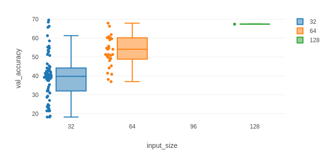
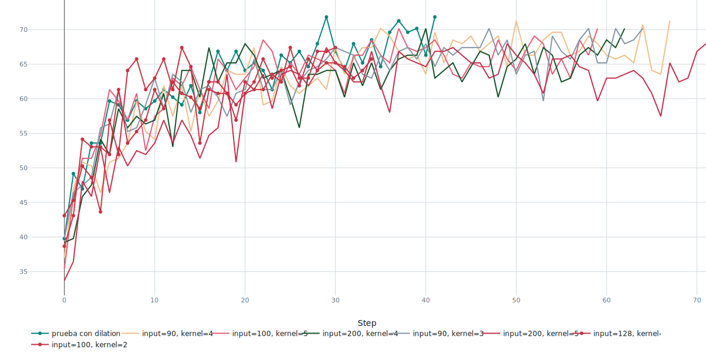
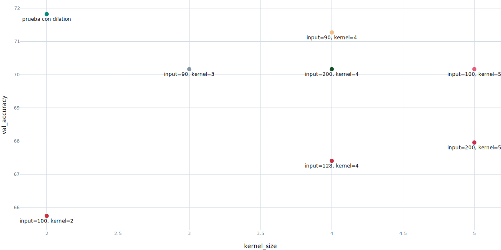
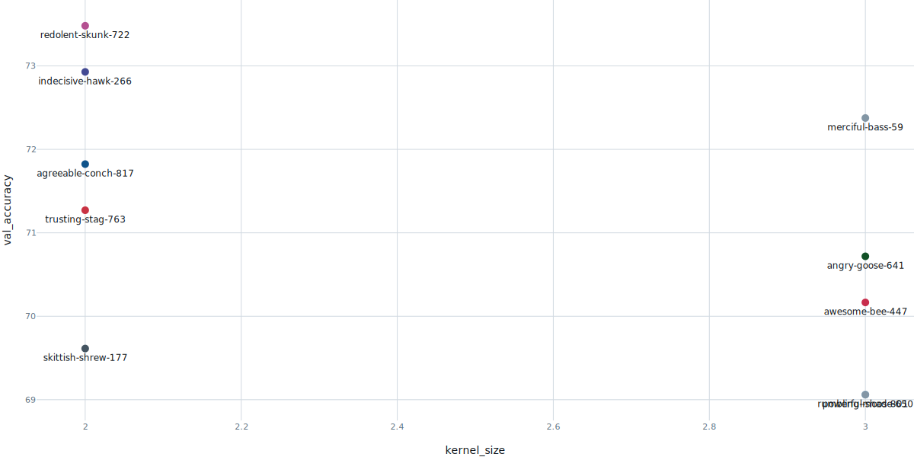

# Modificación de la Red MLP a CNN

Lo primero a hacer en este caso fue modificar la definición del modelo. En particular, con la creación de la clase _CNNClassifier_ en utils.py.

La secuencia de capas se definió como se presentó en clase. Capas convolucionales seguidas de funciones de activación y capas de MaxPool2D, que reducen la dimensión _espacial_ de la salida de las convoluciones. Por último, le siguen dos capas lineales _fully connected_, de las cuales la primera posee _linear_size_ entradas, que representa el tamaño de salida de la segunda MaxPool2D, teniendo en cuenta que no sólo éstas modifican la dimensión de salida, sino también las convolucionales.

En particular, la ecuación de salida de una capa convolucional, según la web oficial de PyTorch, resulta $$W_{out} = \frac{W_{in} + 2 \cdot padding_w - dilation_w \cdot (kernel\_size_w - 1) - 1}{stride_w} + 1 $$

Para calcular estas salidas se hizo la función auxiliar _conv_out()_, que calcula la salida resultante al pasar una entrada de tamaño definido, por una capa convolucional con todos los parámetros de la ecuación.

# Búsqueda de Hiperparámetros
Se adaptó el código del repositorio para entrenar redes variando distintos parámetros:
- Batch Size
- Input Size
- Out Channels (de las capas convolucionales)
- Kernel Size

En particular, se corrieron 138 _Runs_ con hiperparámetros distintos. De todos los modelos posibles, observamos que mientras mayor es la dimensión de la entrada (el tamaño en píxeles de la imagen), mayor el accuracy de validación. En este caso se llegó hasta un 69,61% para el caso de 32x32 pixeles, 67,95% para 64x64 y 67,4% para 128x128.

Si bien se alcanzaron valores mayores de accuracy en valores bajos de _input\_size_, se ve en la figura anterior que la varianza de estos valores es muy alta, y de hecho el valor más alto obtenido puede considerarse un _outlier_.

# Modificación de Modelos

Observando esto, se decidió trabajar con tamaños de imagen cercanos a los 100x100 pixeles, ya que se observó que el incremento por sobre este valor no mejoró la performance del modelo, pero sí multiplicó en gran medida los tiempos de entrenamiento.

Variando tanto el tamaño de entrada como el tamaño del _kernel_ de cada capa, se obtuvo el gráfico de entrenamiento mostrado en la figura anterior. Se observó que el modelo que mejor accuracy mostró fue el que tiene $input\_size=90$ y $kernel\_size=4$

Otro comportamiento relevante es mostrar que, si bien se realizaron pocos entrenamientos distintos de este experimento, tanto los modelos con $kernel\_size$ de 3 como los de 5 mostraron menor accuracy que los kernels de 4x4.

En la esquina superior izquierda del gráfico puede verse al modelo que mejor performance tuvo en este experimento. Este modelo tiene la particularidad de, además de tener kernels más pequeños (2x2), tiene aplicada una dilatación del kernel en la primera capa. De hecho, este modelo resultó el que mejor performance alcanzó de todos los que se probaron.

## Dilation
Las preguntas son ¿Qué es dilation? y ¿porqué hace que el modelo ajuste mejor? 

Al aplicar _dilation_ o _dilatación_ al kernel, lo que se hace es "separar" las celdas de los filtros, dejando en medio celdas que no son filtradas.

Con esto se logra que el filtro abarque un rango espacial mayor evaluando la misma cantidad de pixeles, es decir, es capaz de reconocer patrones espaciales "más grandes" con la misma cantidad de parámetros. Si los patrones que la red debe reconocer no están siempre pegados entre sí, esto puede ayudar al reconocimiento.

La pregunta de por qué ajusta mejor en este caso particular un kernel dilatado de 2x2 no parece ser tan fácil de responder. El resultado de la dilatación de un kernel 2x2 es una distribución que abarca sólo las esquinas de uno de 3x3. Dicho eso, estos últimos deberían contemplar más información sobre el mismo patrón que aprenden los dilatados. Una posible respuesta puede basarse en la estructura espacial de los patrones que la red aprende. Si la información que se encuentra _en medio_ de los patrones no es relevante o es ruidosa, considerarla con filtros de mayor dimensión perjudicaría el rendimiento de la red. 

Para probar esto se realizaron más pruebas, ahora sólamente variando parámetros como la cantidad de canales de salida y el tamaño de la entrada.

La figura muestra el resultado de variar los parámetros antes mencionados. Puede verse que en términos de accuracy siguen dominando los modelos con kernels menores, siendo el mejor valor de accuracy obtenido de 73,48% para el caso de kernels 2x2, y 72,37% para los de 3x3. Esto puede explicarse porque al ser filtros con menos elementos, tienen menos pesos que entrenar, lo que reduce el overfitting si es que existe (al tener entre 50 y 80 muestras por clase para entrenar, es posible que resulten "pocas", es decir, lo suficientemente pocas para que el modelo no generalice luego de entrenar).

Debe destacarse que si bien este método "descarta" pixeles al aplicar cada filtro, aún se analiza cada uno de ellos, pues el funcionamiento las capas convolucionales se basa en _desplazar_ los filtros sobre toda la matriz de entrada. Principalmente en esto difiere este parámetro del _stride_.

_Stride > 1_ implica desplazar el filtro sobre la matriz de entrada en más de una unidad por vez, si se aplica un valor lo suficientemente grande como para que entre movimientos los filtros no se superpongan, o si se combina esta técnica con la dilatación, los pixeles no contemplados no volverán a contemplarse en ninguna de las iteraciones.

# Resultados
.svg)

En la figura anterior se muestran los entrenamientos de los modelos con _dilation_. Comparando esto con los entrenamientos anteriores (donde no se hizo uso de esta técnica), puede notarse que aún entrenando únicamente 12 modelos distintos, más de la mitad supera el 70% de accuracy de validación, sin importar si los modelos tienen kernels de 2x2 o 3x3.

Esta observación sugiere que no es el hecho de tener kernels más pequeños lo que ayuda a la red a generalizar mejor, sino el hecho de insertar ruido en cada filtrado en forma de pixeles "vacíos", y/o el mayor contexto espacial de cada filtro al tomar pixeles más distantes entre sí.