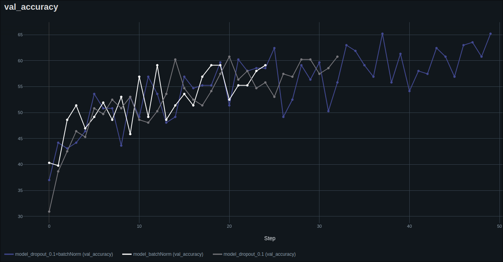
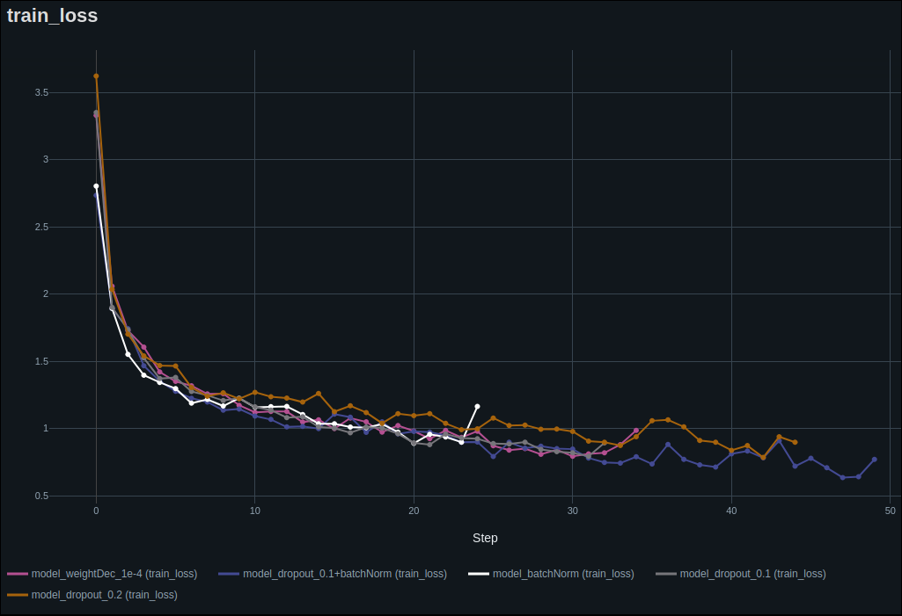
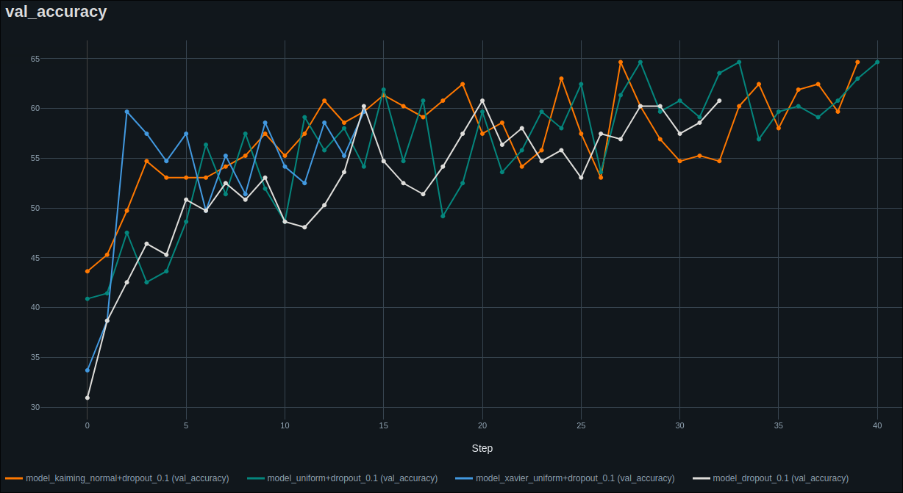

# 25.63 - Redes Neuronales
## TP1 clasificación de imágenes con PyTorch y MLP

Hertter, José Iván - 62499

Diaz Guzmán, Ezequiel - 61602

---

## 1. Dataset y Preprocesamiento
- ¿Por qué es necesario redimensionar las imágenes a un tamaño fijo para una MLP?

Como las redes _MLP_ tienen un numero fijo de entradas $x_i$ es necesario convertir las imágenes a un solo vector. Es decir que si la imágen es de 64x64 pixeles será necesario un vector de *(1x4096)* -> 4096 entradas a la red. Por esto es necesario redimensionar las imágenes para que cumplan con la cantidad de entradas con las que fue entrenada. 

- ¿Qué ventajas ofrece Albumentations frente a otras libresrías de transformación como `torchvision.transforms`?
De la página oficial: 
   1. Fast & performant: "Altamente optimizado", probado en benchmarks de "augmentation"
      - Optimizada internamente con NumPy, reconocida biblioteca muy usada en procesamiento de imágenes, mientras que `torchvision.transforms` usa PIL (Python Imaging Library), que suele resultar más lenta.
   2. Versatilidad: "Más de 100 transformaciones distintas para imágenes y máscaras.
      - permite combinar múltiples transformaciones de forma controlada, lo que `torchvision.transforms` no hace fácilmente.
      - Albumentations tiene funciones "únicas" como aplicado de "motion blur", "random fog"
      - Permite aplicar probabilidades de ocurrencia de cada transformación, además de que pueden 
   3. Probada y confiable. Muy usada en Kaggle.

- ¿Qué hace `A.Normalize()`? ¿Por qué es importante antes de entrenar una red?

`A.Normalize()` permite normalizar los valores de los pixeles de la imagen para que tengan media nula ($\mu=0$) y varianza unitaria ($\sigma=1$). Realizar esto como un paso de pre procesamento permite permite acelerar el entrenamiento, así como también mejorar la estabilidad numérica evitando que haya valores que predominen por encima de otros. Cuando se entrena una red con valores normalizados, se espera que las imágenes que se van a utilizar en tiempo de predicción sean a su vez previamente normalizadas.

- ¿Por qué convertimos las imágenes a `ToTensorV2()` al final de la pipeline?

La conversión a `ToTensorV2()` se hace al final del pipeline de transformaciones porque todas estas se hacen, a través de albumentation, probablemente sobre arreglos de numpy o PIL. La idea es que esta función pase de arreglos numpy modificados, a un formato "apto" para funcionar como entrada a la red neuronal. 

## 2. Arquitectura del Modelo
- ¿Por qué usamos una red MLP en lugar de una CNN aquí? ¿Qué limitaciones tiene?

Asumimos que usamos MLP por simplicidad, ya que resulta intuitivo que la red tome como entrada un vector "aplanado" de una imágen y realice cálculos en cada perceptrón a partir de él. Por este motivo, resulta más fácil construirlas. 

Al tomar cada pixel como una entrada individual, resulta difícil que la red aprenda patrones específicos, como texturas o "bordes". En el caso de este dataset, en el que resulta interesante reconocer la forma de las manchas o sus colores en su conjunto, esta red resultaría "ineficiente". Además, sabiendo que una imagen a color usada acá tendrá $64*64*3=12288$ parámetros distintos, cada uno conectado a una neurona de entrada, que en conjunto forman una capa densa. Esto culmina en un modelo con muchos parámetros "pesado" en memoria y caro en tiempo de cálculo.
   
- ¿Qué hace la capa `Flatten()` al principio de la red?

Convierte la imagen (que es un tensor multidimensional) en un vector unidimensional para que pueda ser procesada por la red MLP, que solo trabaja con vectores.

- ¿Qué función de activación se usó? ¿Por qué no usamos `Sigmoid` o `Tanh`?

Se usó ReLU, que devuelve el mismo valor si es positivo, y 0 si es negativo. Esto hace que sea computacionalmente eficiente, mucho más rápida de calcular que una sigmoidea o una `Tanh`. Esto nos beneficia porque al tener tantas neuronas, mientras más rápido este cálculo, será sustancialmente más rápido el entrenamiento.

En particular, esta función no "satura" para valores "grandes" a la salida de cada neurona, como sí lo harían las otras nombradas. Esto hace que los gradientes no se anulen cuando esto pasa.

   
- ¿Qué parámetro del modelo deberíamos cambiar si aumentamos el tamaño de entrada de la imagen?

El "input_size", es decir, el número de entradas o neuronas de la primera capa

## 3. Entrenamiento y Optimización
- ¿Qué hace `optimizer.zero_grad()`?

Optimizer.zero_grad() pone en cero los gradientes acumulados de los parámetros del modelo, que se acumulan al hacer loss.backward().

- ¿Por qué usamos `CrossEntropyLoss()` en este caso?

Porque estamos resolviendo un problema de clasificación multiclase, y CrossEntropyLoss es la función de pérdida estándar para este tipo de tareas. Combina las funciones logSoftmax y NLLLoss, esto explica por qué luego de la última capa lineal del modelo, no tenemos "nada" que nos clasifique las salidas en las clases existentes, ya que este tipo de loss lo resuelve. 

- ¿Cómo afecta la elección del tamaño de batch (`batch_size`) al entrenamiento?

Afecta la estabilidad y la velocidad del entrenamiento, ya que determina la cantidad de entradas que se procesan antes de actualizar los pesos. Se prevé que para batches más grandes, el entrenamiento será más "estable" porque los gradientes serán más suaves al contemplar en cada paso (o batch), más datos y, de alguna manera, "promediar" el error de un número grande de datos.

- ¿Qué pasaría si no usamos `model.eval()` durante la validación?

`model.eval()` pone al modelo en modo de evaluación, desactivando comportamientos específicos del entrenamiento. Si no usamos esto, parámetros como `dropout()` o `nn.batchNorm1d()` seguirán teniendo efecto, haciendo que las etapas de validación sean inconsistentes, y no reflejen el comportamiento del modelo "real".


## 4. Validación y Evaluación
- ¿Qué significa una accuracy del 70% en validación pero 90% en entrenamiento?

Es una señalde que el modelo está sufriendo de overfitting. El modelo aprende muy bien los datos de entrenamiento, memoriza patrones específicos o ruido en los datos, pero no logra generalizar a datos nuevos o no vistos.

- ¿Qué otras métricas podrían ser más relevantes que accuracy en un problema real?

En casos donde se tienen muchas clases para evaluar, puede ser más relevante una matriz de confusión. Otra métrica podría ser la presición (la tasa de predicciones correctas sobre las totales de cada clase), o el Recall. Otra métrica, habiendo mencionado las dos últimas, es el "F1 Score", que es el "promedio armónico" entre ambas, a modo de íncide de "equilibrio" en las predicciones.

- ¿Qué información útil nos da una matriz de confusión que no nos da la accuracy?

En este contexto, puede indicarnos entre qué clases el modelo se "confunde", es decir, qué clase detecta falsamente frente a alguna clase particular de entrada. Esto trae la ventaja de poder apreciar si los errores vienen de una causa como el overfitting (lo que sería una confusión "grave" entre clases muy distintas), o si las confusiones se dan entre clases que pueden ser similares o hasta equivalentes.

- En el reporte de clasificación, ¿qué representan `precision`, `recall` y `f1-score`?

Precisión: Representa la cantidad de ejemplos que realmente pertenecían a una clase determinada, frente a todos los ejemplos (el total) que el modelo predijo como de esa clase.

Recall: Del total de ejemplos de entrada de una clase particular, representa cuántos fueron detectados correctamente por el modelo. (como un accuracy pero por clase)

F1 Score: Definido como $$F1 = 2\cdot \frac{Precision \cdot Recall}{Precision + Recall}$$ Da una medida de qué tan equilibradas son las predicciones del modelo en cuanto a precision y recall.

## 5. TensorBoard y Logging
- ¿Qué ventajas tiene usar TensorBoard durante el entrenamiento?

Permite visualizar y entender mejor lo que está pasando dentro de tu red en tiempo real (Loss y accuracy por ejemplo).

 Permite correr más de un experimento, cambiando la arquitectura u optimizadores de cada uno, y compararlos gráficamente.

- ¿Qué diferencias hay entre loguear `add_scalar`, `add_image` y `add_text`?

  - `add_scalar`: Se usa para registrar valores numéricos simples que cambian con el tiempo (como métricas de entrenamiento).

   - `add_image`: Puede usarse para mostrar muestras de datos de entrada, salidas del modelo o mapas de activación.

   - `add_text`: Se usa para loguear texto. Útil para documentar detalles que no son fácilmente representables numéricamente.

- ¿Por qué es útil guardar visualmente las imágenes de validación en TensorBoard?

Puede ayudar a hacer un debugging del modelo en caso de que su rendimiento sea bajo, observando las imágenes y sus etiquetas para, por ejemplo, detectar imágenes (valga la redundancia) confusas o hasta incorrectas en donde está "bien" que el modelo falle. También es útil para ver si las imágenes usadas no contienen cantidades altas de contenido irrelevante (como fondo, u objetos que no es relevante documentar).

- ¿Cómo se puede comparar el desempeño de distintos experimentos en TensorBoard?

Pueden compararse en la interfaz de tensorflow al haber guardado cada experimento por separado y luego cargando las runs de cada uno a ella con el comando `tensorboard --logdir {path_a_runs}`. Comop respuesta, tensorboard monta un server local y nos permite ver las métricas de cada experimento en un navegador.

## 6. Generalización y Transferencia
- ¿Qué cambios habría que hacer si quisiéramos aplicar este mismo modelo a un dataset con 100 clases?

Debería cambiarse este número en los hiperparámetros, con esto se cambiaría la capa de salida, ajustando el número de salidas al número de clases. En cuanto al manejo del dataset, se debería corroborar que no existan clases demasiado desbalanceadas para no sesgar el aprendizaje de la red. Relacionado con lo último, el learning rate debería ser lo suficientemente pequeño para garantizar estabilidad en el aprendizaje.

En cuanto al entrenamiento, sería adecuado colocar dropout y técnicas de early stopping para reducir la cantidad de épocas y el tiempo de entrenamiento.

- ¿Por qué una CNN suele ser más adecuada que una MLP para clasificación de imágenes?

Porque tienen la capacidad de manejar estructuras espaciales, como patrones y texturas. Además, eliminan la dependencia en la forma de representar un objeto. En una CNN, si el objeto rota o cambia de posición, el patrón característico se seguirá reconociendo independientemente de su posición, por los filtros convolucionales en los que se basa (esto hace a este modelo más robusto frente al ruido en las imágenes). Otro motivo es su eficiencia computacional, ya que una CNN suele tener muchos menos parámetros que una MLP, haciéndola así más barata en cálculo.

- ¿Qué problema podríamos tener si entrenamos este modelo con muy pocas imágenes por clase?

   Tendríamos overfitting, ya que el modelo tendería a memorizar las imágenes del entrenamiento, llegando a mediciones de accuracy de train de más de 90%, y valores bajos de validación. Esto hace que el modelo no aprenda variaciones o diversidad de los datos y no generaliza.

- ¿Cómo podríamos adaptar este pipeline para imágenes en escala de grises?

Debe cambiarse desde la forma de cargar los datos del dataset (Image.open().convert("L")), pasando por las transformaciones, asegurándonos que estemos haciendo transformaciones compatibles con grayscale (se sabe que RandomBrightnessContrast() funciona igual en este caso). Por último, deberíamos cambiar la capa de entrada del modelo, ya que no se tienen 3 valores por pixel, sino uno sólo (`input_size = 64*64*1`).

## 7. Regularización

### Preguntas teóricas:
- ¿Qué es la regularización en el contexto del entrenamiento de redes neuronales?

Son métodos que se utilizan para evitar el overfitting buscando reducir la complejidad del modelo. Tienen como objertivo mejorar el rendimiento para datos con los que no fue entrenada la red, es decir, validación y test. El uso de estas técnicas es necesario para reducir la influencia de ruido o patrones irrelevantes.

- ¿Cuál es la diferencia entre `Dropout` y regularización `L2` (weight decay)?

Ambas son técnicas para evitar llegar a un modelo con overfitting. `Dropout(dropout_rate)` apaga neuronas de forma aleatorua con probabilidad `dropout_rate` durante el entrenamiento. Durante la inferencia, todas las neuronas van a estar activas pero para compensar la ausencia de dropout en entrenamiento, sus pesos se escalan por $1-dropout\_ rate$. El objetivo de esto es evitar la co-dependencia de las neuronas y en lugar de eso aprendan características útiles e independientes.

Por otro lado, la regularización L2 introduce un término proporcional a la norma L2 de los pesos, por lo que el índice `weight_decay` regula la penalización. Esto permite que valores cercanos a cero se vean más beneficiados, permitiendo un modelo más simple. Además reduce la magnitud de los pesos evitando que pesos demasiado grandes dominen el entrenamiento. Se suelen utilizar valores entre $1e-5$ y $1e-3$. Mientras más grande es el valor de `weight_decay` más se penaliza el peso.

- ¿Qué es `BatchNorm` y cómo ayuda a estabilizar el entrenamiento?

Es una técnica que normaliza las activaciones de cada capa para acelerar y estabilizar el entrenamiento. Para cada batch de datos, calcula la media y varianza de las activaciones en una capa, con estos datos, normaliza las activaciones a una distribución con media 0 y varianza 1. A su vez, introduce parámetros aprendibles para el cálculo de la normalización. Con esto, reduce el "Internal Covariate Shift", fenómeno que se introduce cuando durante el entrenamiento las capas actualicen sus parámetros, afectando a las capas a las que se conectan con un "bias" producto de la normalización desactualizada que tendrían si no se aplicace esta técnica. Cabe aclarar que al aplicar `BatchNorm` no se tendrán normalizaciones desactualizadas en las capas a las que se aplique.

- ¿Cómo se relaciona `BatchNorm` con la velocidad de convergencia?

Empíricamente, se demostró que el uso de esta técnica reduce la cantidad de épocas necesarias para que el entrenamiento converja. Al normalizar las activaciones en cada batch, estabiliza la distribución de entrada para cada capa. Como resultado, las capas posteriores aprenden más rápido porque reciben datos con estadísticas estables. A su vez, al mantener las activaciones en rangos controlados, el modelo puede soportar Learning Rates más altos sin diverger, lo que acelera la convergencia.

- ¿Puede `BatchNorm` actuar como regularizador? ¿Por qué?

Las estadísticas (media/varianza) se calculan por batch, y como éstos cálculos varían entre batches, terminan introduciendo cierto ruido estocástico en cada uno. Esto puede prevenir overfitting leve (similar a Dropout pero menos brusco que descartar neuronas); y con esto ayudar a escapar de mínimos locales, acelerando la exploración del espacio de parámetros.

- ¿Qué efectos visuales podrías observar en TensorBoard si hay overfitting?

El primer índice de overfitting se va a manifestar en las curvas **train/loss** y **val/loss**. Si la pérdida de train disminuye, pero la de validación aumenta o se *plancha* es un claro indicio de que hay overfitting. Otro indicador, pero que no es necesario el uso de tensorboard para identificarlo, es si hay una brecha muy grande (mayor a $20\%$) entre el accuracy de train y de validacion.

> Notar que `acc_train > acc_val` 

Tensorboard es muy útil para deteectar overfitting por medio de los histogramas de pesos. Cuando tienen colas muy largas se puede suponer que hay overfitting ya que indica que hay pesos grandes que dominan sobre otros.

- ¿Cómo ayuda la regularización a mejorar la generalización del modelo?

Evita que el modelo *memorice* los datos en entrenamiento, sino que lo induce a aprender patrones útiles aplicables sobre conjuntos de datos no conocidos por la MLP. Aplicar técnicas de regularizacion permite disminuir la complejidad del modelo y reducir su sensibilidad al ruido. Además de las técnicas que se mencionaron anteriormente, se puede aplicar `EarlyStopping`, que frena el entrenamiento si no se observa una mejora en la `val_accuracy` durante muchas épocas. Esto evita que el modelo genere overfitting al seguir entrenando sin ganar generalización.

### Actividades de modificación:
1. Agregar Dropout en la arquitectura MLP:
   - Insertar capas `nn.Dropout(p=0.5)` entre las capas lineales y activaciones.
   - Comparar los resultados con y sin `Dropout`.

Al agregar dropout de 0.5 se obtuvieron resultados menores a los que se obtuvieron sin dropout, tiene sentido por el lado de que la mitad de las neuronas está apagada en cada entrenamiento. 

Notamos que la variación entre accuracy's consecutivos fue muy alta, lo que nos llevó a pensar que podríamos estar perdiendo entrenamientos importantes al usar un early stopping pequeño (5). Pensando en esto, aumentamos el early stopping para dar chance a que aquella "subred" formada que tiene el accuracy más alto "entrene más". Haciendo esto en el caso de Dropout=0.2 (caso que dio mejor resultado que 0.5), obtuvimos una mejora en el accuracy del 10%!. Esto refuerza nuestra teoría de que al usar dropout, deben usarse valores de "paciencia" para el early stopping superiores a los que se usaría si no se tiene dropout.

También notamos que al cambiar el dropout de 0.2 a 0.1, se obtiene el mismo valor de accuracy (a veces un 1% inferior), pero el dropout 0.1 tarda menos épocas en entrenarse (converge antes).

2. Agregar Batch Normalization:
   - Insertar `nn.BatchNorm1d(...)` después de cada capa `Linear` y antes de la activación:
     ```python
     self.net = nn.Sequential(
         nn.Flatten(),
         nn.Linear(in_features, 512),
         nn.BatchNorm1d(512),
         nn.ReLU(),
         nn.Dropout(0.5),
         nn.Linear(512, 256),
         nn.BatchNorm1d(256),
         nn.ReLU(),
         nn.Dropout(0.5),
         nn.Linear(256, num_classes)
     )
     ```

1. Aplicar Weight Decay (L2):
   - Modificar el optimizador:
     ```python
     optimizer = torch.optim.Adam(model.parameters(), lr=0.001, weight_decay=1e-4)
     ```
Utilizar weigh_decay nos genero los mejores resultados. Cuando usamos un wd muy pequeño junto con dropout los resultados empeoraron. 
   - `weight_decay=1e-4` + `dropout=0.1` $\to$ peores resultados
   - `weight_decay=1e-3` + `dropout=0.1` $\to$ buenos resultados. `val_acc~60%` pero tardó más épocas en converger.
   - `weight_decay=1e-4` + `dropout=0.1` $\to$ peores resultadost


4. Reducir overfitting con data augmentation:
   - Agregar transformaciones en Albumentations como `HorizontalFlip`, `BrightnessContrast`, `ShiftScaleRotate`.

Para los casos anteriores ya veniamos aplicando estos métodos de data augmentation así que decidimos ir por el contra ejemplo. Los resultados para esto

5. Early Stopping (opcional):
   - Implementar un criterio para detener el entrenamiento si la validación no mejora después de N épocas.
Implementamos un *Early Stopping* que corta el entrenamiento si luego de 10 epocas el *accuracy validation* no mejora.

### Preguntas prácticas:
- ¿Qué efecto tuvo `BatchNorm` en la estabilidad y velocidad del entrenamiento?

Cuando entrenamos únicamente con `nn.batchNorm1d()` los resultados fueron inferiores a los obtenidos cuando entrenamos la MLP con `nn.dropout(0.1)`, por más que se haya acelerado el proceso. 

- ¿Cambió la performance de validación al combinar `BatchNorm` con `Dropout`?

Cuando se entrenó con `nn.batchNorm1d()` y `nn.dropout(0.1)` se obtuvieron mejores resultados. Hubo mayor accuracy pero con oscilaciones, indicando inestabilidad por la interacción entre el ruido de Dropout y las estadísticas de BatchNorm. Esto no garantiza mejor generalización. De esta manera, no tenemos claro si este mayor valor de accuracy es síntoma de un mejor modelo de entrenamiento.



- ¿Qué combinación de regularizadores dio mejores resultados en tus pruebas?

|Técnica|val accuracy|Best epoch|
|-------|------------|----------|
|`dropout=0.5`|$43.64\%$|9|
|`dropout=0.2`|$61.32\%$|32|
|`dropout=0.1`|$60.77\%$|20|
|`batchNorm1d`|$59.11\%$|12|
|`batchNorm1d` & `dropout=0.1`|$65.16\%$|37|
|`weight_decay=1e-4`|$62.98\%$|22|
|`weight_decay=1e-4` & `dropout=0.1`|$58.56\%$|12|
|`weight_decay=1e-3` & `dropout=0.1`|$62.3\%$|36|

Basandome únicamente en los resultados finales obtenidos se podría afirmar que la mejor combinación de regularizadores es `batchNorm1d` & `dropout=0.1`, pero como se mencionó antes, esta combinación genera inestabilidad. Por esto, teniendo en cuenta las curvas de val accuracy y en los resultados finales, la comobinación que mejor resultado genera en cuato al tiempo de entrenamiento y val accuracy es `weight_decay=1e-4`.

- ¿Notaste cambios en la loss de entrenamiento al usar `BatchNorm`?

A pesar de que esperábamos que la loss baje sustancialmente, no fue lo que observamos. Atribuímos este resultado inesperado al uso de técnicas de data augmentation para el entrenamiento, lo que ingresa ruido al conjunto, ruido que la normalización no puede compensar satisfactoriamente y por eso prevalece en los datos.



## 8. Inicialización de Parámetros

### Preguntas teóricas:
- ¿Por qué es importante la inicialización de los pesos en una red neuronal?

Porque determina cómo comienza el proceso de aprendizaje y afecta directamente la convergencia, estabilidad y rendimiento final del modelo. Un caso especial es, por ejemplo, si los pesos se inicializan con valores demasiado pequeños, las activaciones y gradientes se reducen exponencialmente en capas profundas, estancando el aprendizaje. Como contraparte, pesos demasiado grandes causan que los gradientes crezcan descontroladamente, llevando a divergencias numéricas.

- ¿Qué podría ocurrir si todos los pesos se inicializan con el mismo valor?

Todas las neuronas en una misma capa recibirán actualizaciones idénticas durante el backpropagation, ya que calcularán los mismos gradientes, por lo que podría darse el caso de que cada neurona sea una réplica de las demás, generando redundancias indeseadas y desperdiciando la capacidad de cálculo del modelo.

- ¿Cuál es la diferencia entre las inicializaciones de Xavier (Glorot) y He?

La inicialización de Xavier parte de una distribución uniforme para inicializar _probabilísticamente_ los pesos del modelo. $$W \approx U\left( -\sqrt{\frac{6}{n_{in}+n_{out}}}, \sqrt{\frac{6}{n_{in}+n_{out}}} \right)$$
Esta técnica busca balancear la varianza de las activaciones _forward_ y _backward_, es decir, teniendo en cuenta la evolución de los gradientes desde la entrada a la salida y viceversa. Y parte de la hipótesis de que las activaciones son simétricas (como `tanh`).

La inicialización de He se basa en una distribución normal: $$W \approx N \left( 0, \sqrt{\frac{2}{n_{in}}} \right)$$

Ajusta la varianza solo para el caso _forward_. Parte de la hipótesis de que la función de activación descarta la mitad del espacio de resultados. 

- ¿Por qué en una red con ReLU suele usarse la inicialización de He?

ReLU es asimétrico (solo propaga valores positivos). Esto causa que la varianza de las activaciones se reduzca a la mitad en cada capa durante el forward pass. Para corregirlo, He escala la varianza de los pesos a $\frac{2}{n_{in}}$, logrando que las activaciones en capas ocultas no colapsen hacia cero, matando el aprendizaje.

- ¿Qué capas de una red requieren inicialización explícita y cuáles no?

Deben inicializarse las capas que tengan parámetros aprendibles, que no sólo dependan de hiperparámetros para funcionar correctamente, es decir, las capas de entrada y salida, y aquellas capas ocultas que no sean de activación.

Las que no requieren inicialización son las que no tienen parámetros que deben variar con el entrenamiento, como las capas de activación (ReLU por ejemplo), las de normalización (batchNorm1D) y las de Dropout.

### Actividades de modificación:
1. Agregar inicialización manual en el modelo:
   - En la clase `MLP`, agregar un método `init_weights` que inicialice cada capa:
     ```python
     def init_weights(self):
         for m in self.modules():
             if isinstance(m, nn.Linear):
                 nn.init.kaiming_normal_(m.weight)
                 nn.init.zeros_(m.bias)
     ```

2. Probar distintas estrategias de inicialización:
   - Xavier (`nn.init.xavier_uniform_`)
   - He (`nn.init.kaiming_normal_`)
   - Aleatoria uniforme (`nn.init.uniform_`)
   - Comparar la estabilidad y velocidad del entrenamiento.

3. Visualizar pesos en TensorBoard:
   - Agregar esta línea en la primera época para observar los histogramas:
     ```python
     for name, param in model.named_parameters():
         writer.add_histogram(name, param, epoch)
     ```

### Preguntas prácticas:
- ¿Qué diferencias notaste en la convergencia del modelo según la inicialización?

Se puede observar que agregar una instancia de inicialización manual mejora los resultados obtenidos. Se realizó una prueba con el modelo original utilizando `dropout=0.1`.
   - `nn.init.xavier_uniform_()` $\to$ el val_accuracy llegó a los mismos niveles que sin inicializacion pero lo hizó en menos iteraciones.
   - `nn.init.uniform_()` $\to$ si bien no tuvo un rapido crecimiento de val_accuracy al principio, alcanzó casi una mejora del $6.4\%$
   - `nn.init.kaiming_normal_()` $\to$ el comportamiento fue muy similar al anterior caso pero en las primeras épocas el rendimiento fue mejor.

- ¿Alguna inicialización provocó inestabilidad (pérdida muy alta o NaNs)?

No, ninguna inicialización provocó inestabilidad. En menoor o mayor cantidad de iteraciones, todas crecían de forma progresiva y mostraban una tendencia a converger a resultados similares o mayores al modelo sin inicialización.

- ¿Qué impacto tiene la inicialización sobre las métricas de validación?

La inicialización afecta tanto la velocidad de convergencia como resultado o rendimiento final del la red. En particular, `nn.init.xavier_uniform_()` y `nn.init.kaiming_normal_()` mejoran la eficiencia del entrenamiento, permitiendo así que la red tenga mejores resultados más rápido. Una mala inicialización puede hacer que el modelo demore más en aprender o no alcance resultados óptimos. Esto último puede observarse en el caso donde no hay inicializacion.



- ¿Por qué `bias` se suele inicializar en cero?

Como el bias no afecta la varianza de la activación, se lo inicializa en cero para no introducir sesgos arbitrarios desde el principio. A diferencia de los pesos, inicializar el bias en cero no genera problemas de simetría, se lo considera una buena práctica.